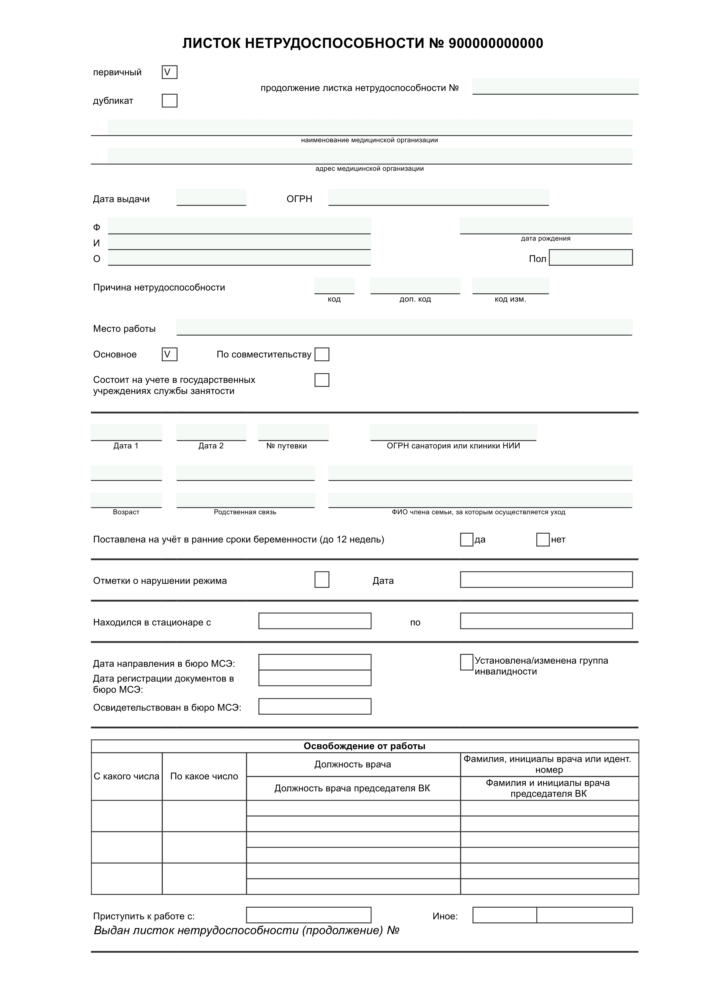

# Больничный лист

Внешняя печатная форма документа "Больничный лист" для конфигурации "Зарплата и кадры государственного учреждения 3.1". Позволяет распечатывать больничные листы, загруженные из ФСС.

### Системные требования
- Версия платформы: 8.3.15.1700
- [Включенный механизм дополнительных отчетов и обработок](https://its.1c.ru/db/bsp303doc#content:1865:hdoc)

### Поддерживаемые конфигурации
- "Зарплата и кадры государственного учреждения", редакция 3.1 (3.1.9.229)

### Скриншоты

